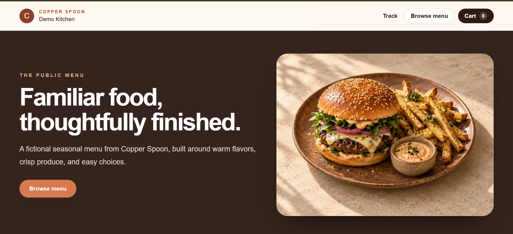
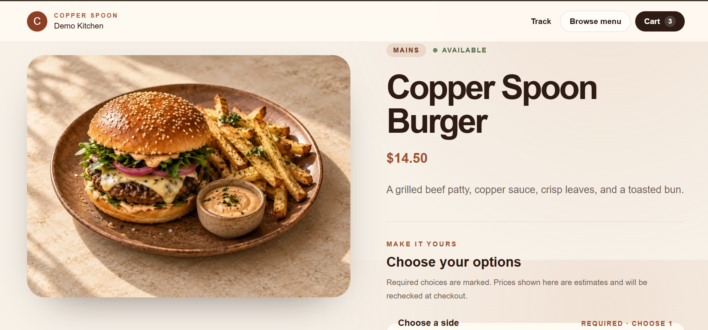
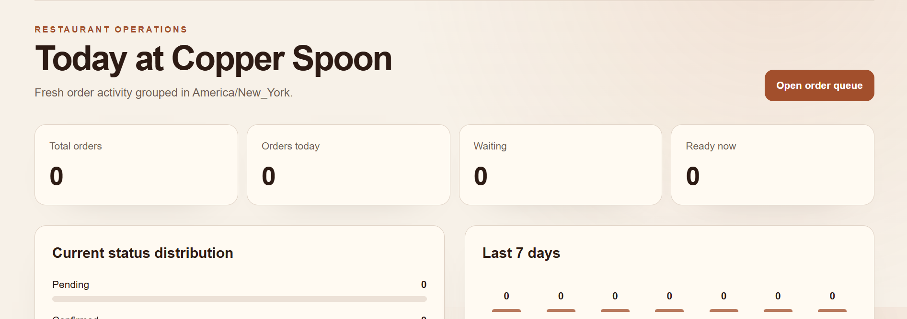
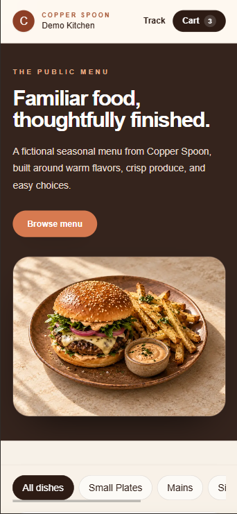

# Copper Spoon

Copper Spoon is a production-style restaurant ordering application for a fictional single-location restaurant. It combines a responsive customer ordering flow with a role-protected workspace for restaurant staff.

The project models the parts of online ordering that are easy to overlook: current availability and pricing, immutable order history, controlled status transitions, staff authorization, and safe public order tracking.

**Deployment status:** the Vercel application and Supabase PostgreSQL database have been verified through hosted QA.

## Features

### Customer experience

- Browse and search a published menu.
- Configure required and optional item choices.
- Maintain a browser-persisted cart.
- Submit pickup or delivery orders without an account.
- Track an order with a non-sequential public code.
- View immutable item snapshots, totals, status, and recorded timeline events.

### Staff and administration

- Credentials-based access for `STAFF` and `ADMIN` roles.
- Operational dashboard with status counts, recent orders, seven-day activity, fulfilment mix, and popular items.
- Searchable order queue and controlled status transitions.
- Category, menu item, option, publication, availability, and archive management.
- Staff account creation, role/status management, and password replacement.
- Protection against self-lockout and removal of the final active administrator.

The application uses simulated payment choices only. It does not process card data, create customer accounts, manage drivers, or support multiple restaurants.

## Product preview

### Public menu



### Item configuration



### Restaurant operations



### Responsive menu



## Technology

- Next.js 16 App Router, React 19, TypeScript, and Tailwind CSS 4
- PostgreSQL 17 and Prisma ORM 7 with `@prisma/adapter-pg`
- Auth.js credentials authentication and bcrypt password hashing
- Zod validation at server boundaries
- Vitest, ESLint, TypeScript, and GitHub Actions
- Docker PostgreSQL for local development
- Vercel and Supabase PostgreSQL for the hosted demo architecture

## Architecture

Copper Spoon is a single Next.js application. Server Components perform reads, Server Actions handle first-party mutations, Auth.js manages staff sessions, and server-only modules contain authorization, database access, and transactional business logic.

Important design choices include:

- Integer minor-unit money values
- Server-authoritative checkout pricing
- Immutable order item and option snapshots
- Serializable, idempotent order creation
- Transactional order status events
- Database-backed active-user authorization
- PostgreSQL rate limiting across serverless instances
- Cached public catalog reads and fresh operational reads

See [Architecture](docs/ARCHITECTURE.md), [Database Design](docs/DATABASE.md), [Security](docs/SECURITY.md), and [Architecture Decisions](docs/DECISIONS.md).

## Local development

Requirements:

- Node.js 24 LTS
- npm 11 or later
- Docker Desktop with Compose

PowerShell setup:

```powershell
nvm use
npm ci
Copy-Item .env.example .env
docker compose up -d postgres
npm run db:migrate
npm run db:seed
npm run dev
```

On macOS or Linux, replace `Copy-Item` with `cp`.

The Docker database is bound to `127.0.0.1:5433`; PostgreSQL still listens on port `5432` inside the container. Replace the placeholder password in `POSTGRES_PASSWORD`, `DATABASE_URL`, and `DIRECT_URL` before starting.

Open `http://localhost:3000` for the public site or `http://localhost:3000/admin/login` for staff access.

## Development administrator

No staff account is seeded. Create a local administrator after migrations complete:

```powershell
$env:NODE_ENV = "development"
$env:ADMIN_PROVISION_MODE = "development"
$env:ADMIN_PROVISION_NAME = "Fictional Demo Admin"
$env:ADMIN_PROVISION_EMAIL = "admin@copperspoon.example"
$env:ADMIN_PROVISION_PASSWORD = "choose-a-unique-local-password"
npm run admin:provision
Remove-Item Env:ADMIN_PROVISION_PASSWORD
```

Passwords must be 12-72 UTF-8 bytes and contain a letter, number, and symbol. Provisioning creates a new active administrator and refuses to modify an existing account.

## Database commands

```bash
npm run db:validate   # validate the Prisma schema
npm run db:generate   # generate Prisma Client
npm run db:migrate    # create and apply local development migrations
npm run db:deploy     # apply committed migrations
npm run db:status     # inspect migration state
npm run db:seed       # load the fictional development catalog and settings
npm run db:smoke      # query settings and catalog counts
```

`db:seed` is for development because it normalizes restaurant settings and matching catalog records. The guarded `npm run demo:catalog:bootstrap` command is used for the hosted demo. It creates missing fictional catalog records through `DIRECT_URL` and leaves existing settings, users, orders, and matching catalog records unchanged.

## Quality checks and CI

```bash
npm run lint
npm run typecheck
npm test
npm run build
git diff --check
```

GitHub Actions runs these checks on Node 24 and applies all migrations to an ephemeral PostgreSQL 17 service. Production credentials are not available to pull-request jobs.

## Deployment

The deployment path is:

```text
Vercel -> Next.js -> Prisma -> Supabase PostgreSQL
```

Application traffic uses the Supabase Transaction Pooler through `DATABASE_URL`. Prisma CLI and migration commands use the Session Pooler through `DIRECT_URL`. Production migrations, administrator provisioning, and demo catalog creation are separate controlled steps.

See [Deployment](docs/DEPLOYMENT.md), [Hosted QA](docs/HOSTED_QA.md), and [Screenshot Inventory](docs/SCREENSHOTS.md).

## Repository structure

```text
docs/          Product, design, screenshots, operations, and delivery documentation
prisma/        Schema, migrations, development seed, and smoke check
public/        Static images and public assets
scripts/       Controlled operational commands
src/app/       Next.js routes, layouts, and route handlers
src/features/  Feature UI, schemas, actions, and domain helpers
src/server/    Server-only authorization, persistence, and services
tests/         Automated tests
```

## Documentation

- [Product Requirements](docs/PRODUCT_REQUIREMENTS.md)
- [Architecture](docs/ARCHITECTURE.md)
- [Database Design](docs/DATABASE.md)
- [Application Interfaces](docs/API.md)
- [Security](docs/SECURITY.md)
- [Testing Strategy](docs/TESTING.md)
- [Deployment](docs/DEPLOYMENT.md)
- [Architecture Decisions](docs/DECISIONS.md)
- [Implementation Roadmap](docs/TASKS.md)
- [Definition of Done](docs/DEFINITION_OF_DONE.md)
- [Case Study](docs/CASE_STUDY.md)
- [Image Assets](docs/IMAGE_ASSETS.md)

All committed demo names, contact details, menu content, users, and orders are fictional.
