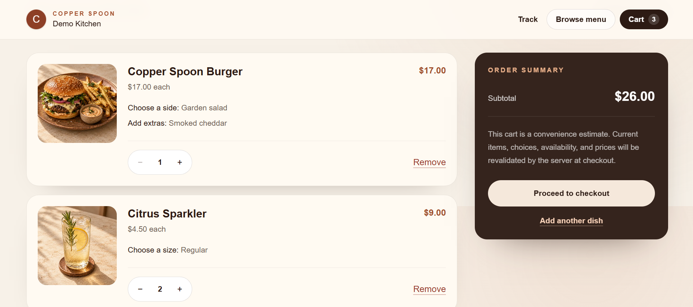
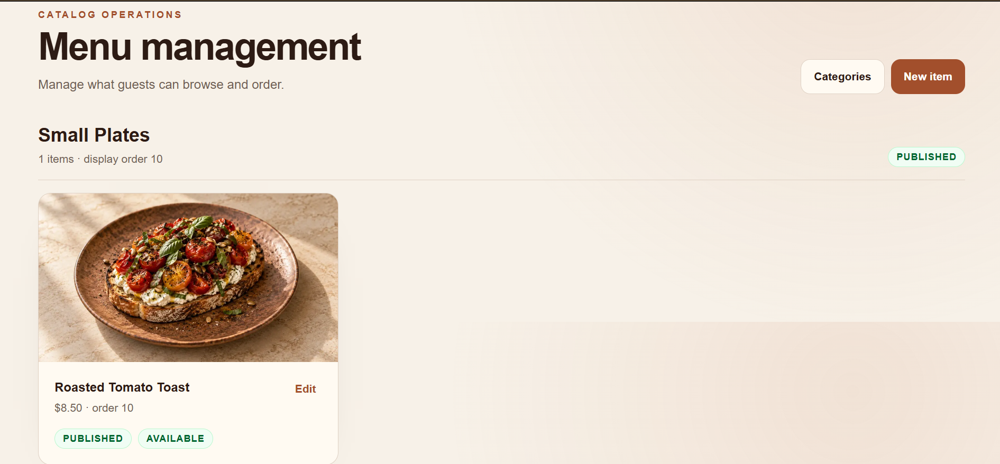
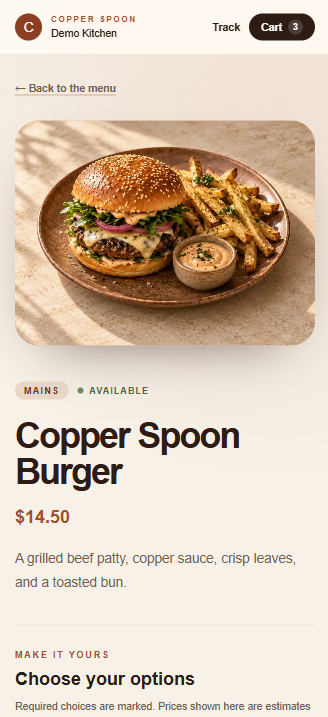
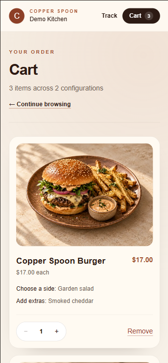

# Copper Spoon Case Study

## Overview

Copper Spoon is a fictional restaurant ordering and operations application. It covers the customer transaction, staff workflow, catalog administration, account management, and operational reporting needed by a single restaurant.

It is a portfolio project, not evidence of real customers, revenue, payment processing, or restaurant usage.

## Problem

Online ordering involves more than a menu and cart. Prices and availability can change while a guest browses, submitted orders must remain historically accurate, kitchen staff need a constrained workflow, and administrators need control without exposing credentials or customer data.

## Solution

The application combines a mobile-first ordering flow with a role-protected staff workspace. The server validates and reprices every order, stores immutable snapshots, writes status events transactionally, and exposes different data models for customers and staff.

## Customer flow

Guests browse published dishes, configure choices, maintain a local cart, and submit pickup or delivery details without creating an account. Checkout returns a non-sequential public code. Confirmation and tracking show immutable order content, totals, status, and recorded timeline timestamps without exposing contact or staff data.

The public menu pairs direct navigation with a focused restaurant identity and repository-local food imagery.

Item configuration makes required choices and estimated pricing explicit before anything enters the cart.

The cart preserves each configuration separately and clearly distinguishes its estimate from server-authoritative checkout pricing.

## Restaurant workflow

Active staff use the dashboard and order queue to review and progress orders. Cancellation authority depends on role and current state. Administrators also manage categories, items, options, availability, and staff accounts.

The protected dashboard summarizes current workload and recent operating activity without presenting simulated payment totals as revenue.

Catalog management exposes publication and availability state while preserving the non-destructive lifecycle used by historical orders.

## Architecture

~~~mermaid
flowchart LR
  Guest[Guest browser] --> Public[Public pages]
  Staff[Staff browser] --> Auth[Auth.js]
  Public --> App[Next.js on Vercel]
  Auth --> App
  App --> Services[Domain services]
  Services --> Prisma[Prisma ORM]
  Prisma --> Supabase[(Supabase PostgreSQL)]
~~~

The single Next.js application owns rendering, Auth.js endpoints, Server Actions, domain policies, and server-only repositories. Client Components are limited to interactions such as the cart, filters, and forms.

## Data and transaction design

PostgreSQL stores restaurant settings, users, catalog data, orders, immutable snapshots, status events, and rate-limit buckets. Money uses integer minor units.

Checkout resolves an idempotency token, validates current catalog data, recalculates prices, creates snapshots, persists totals, and appends the initial event in one serializable transaction.

Status changes combine optimistic concurrency with an atomic audit event. Staff role/status changes preserve the final active administrator in a serializable transaction.

## Authentication and security

Auth.js credentials authentication verifies bcrypt cost-12 hashes and issues eight-hour encrypted JWT sessions. Protected work re-reads the active database user so disabled or demoted accounts cannot rely on stale session claims.

Login, checkout, and public tracking use PostgreSQL rate limits keyed by HMAC digests. Responses include CSP and other security headers. Public order models exclude contact, address, staff, note, token, and internal-ID fields.

## User experience

The public flow supports mobile widths from 320 px. Administrative tables adapt to cards on narrow screens. The interface includes semantic landmarks, labelled controls, visible focus, reduced-motion support, and route-specific loading, empty, and error states.

Repository-local WebP images use next/image with responsive sizing and fallback visuals.

The same menu, item, and cart flows retain their hierarchy and controls at narrow mobile widths.

## Testing and delivery

Vitest covers pricing, validation, checkout idempotency, snapshot handling, transitions, concurrency, credentials, authorization, staff safety, analytics, rate limiting, public data minimization, and production bootstrap guards.

GitHub Actions generates and validates Prisma, applies migrations to PostgreSQL 17, then runs lint, type checking, tests, and the production build.

## Deployment architecture

~~~text
Vercel -> Next.js -> Prisma -> Supabase PostgreSQL
~~~

Application traffic uses the Supabase Transaction Pooler through DATABASE_URL. Prisma CLI and migrations use the Session Pooler through DIRECT_URL. Production migration, administrator provisioning, and fictional catalog creation are separate controlled operations.

The Vercel deployment, Supabase connection, hosted QA, and final portfolio screenshot pass are complete.

## Key engineering decisions

- One full-stack application keeps authorization and transaction boundaries coherent.
- Server-authoritative pricing prevents client cart data from becoming commercial truth.
- Snapshot duplication preserves historical accuracy when the catalog changes.
- Public and administrative view models minimize accidental data exposure.
- PostgreSQL rate limits work across serverless instances without another data service.
- Simulated payments demonstrate workflow without collecting card information.

## Known limitations

- No real payments, customer accounts, notifications, driver tracking, or settings editor
- No configured browser end-to-end test suite
- Monitoring, retention, recovery rehearsal, and deployed performance evidence are pending
